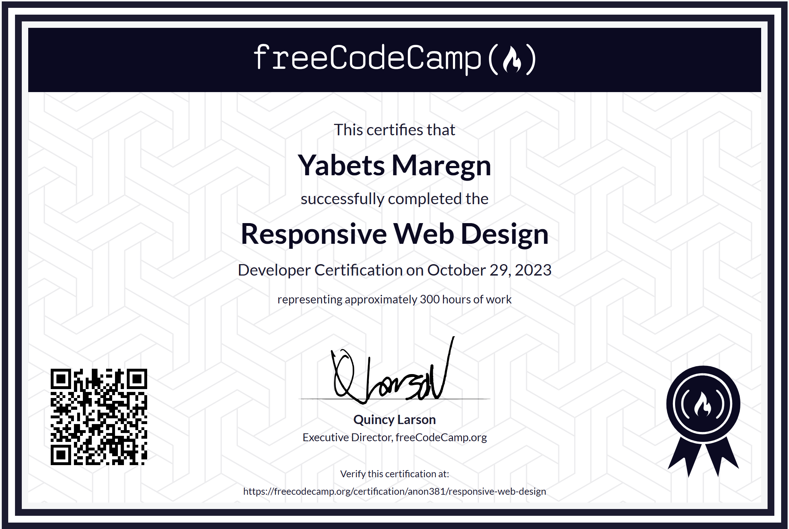

## Certificate

Below is the certificate for completing the freeCodeCamp Responsive Web Design projects:

# freeCodeCamp Responsive Web Design Projects

This repository contains solutions for the freeCodeCamp Responsive Web Design certification projects. Each project is organized in its own folder, and every folder contains the following files:

## Folder Structure

- **Build a Personal Portfolio Webpage/**
  - `index.html` — Main HTML file for the Personal Portfolio Webpage
  - `index.css` — Stylesheet for the Personal Portfolio Webpage
  - `instruction.md` — Project instructions and requirements
  - `testcase.md` — Test cases for the project

- **Build a Product Landing Page/**
  - `index.html` — Main HTML file for the Product Landing Page
  - `index.css` — Stylesheet for the Product Landing Page
  - `instruction.md` — Project instructions and requirements
  - `testcase.md` — Test cases for the project

- **Build a Survey Form/**
  - `index.html` — Main HTML file for the Survey Form
  - `instruction.md` — Project instructions and requirements
  - `testcase.md` — Test cases for the project

- **Build a Technical Documentation Page/**
  - `index.html` — Main HTML file for the Technical Documentation Page
  - `index.css` — Stylesheet for the Technical Documentation Page
  - `instruction.md` — Project instructions and requirements
  - `testcase.md` — Test cases for the project

- **Build a Tribute Pag/**
  - `index.html` — Main HTML file for the Tribute Page
  - `index.css` — Stylesheet for the Tribute Page
  - `instruction.md` — Project instructions and requirements
  - `testcase.md` — Test cases for the project

## Notes
- Each folder is self-contained and includes everything needed for the corresponding project.
- The `instruction.md` files describe the requirements and user stories for each project.
- The `testcase.md` files list the test cases that the project should pass.
- All styles are in the respective `index.css` files (if present).

**Estimated Time:**
Completing the freeCodeCamp Responsive Web Design certification typically takes around 300 hours.

Feel free to explore each folder for the code, instructions, and test cases for every project!

